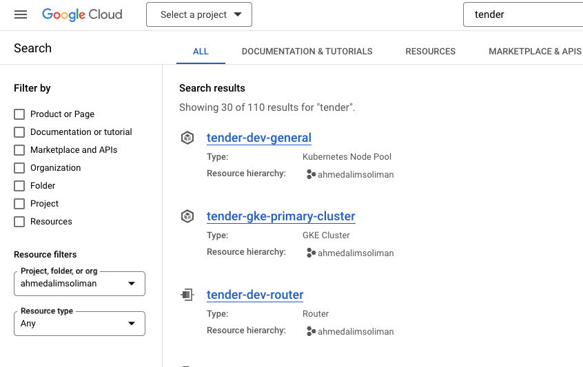
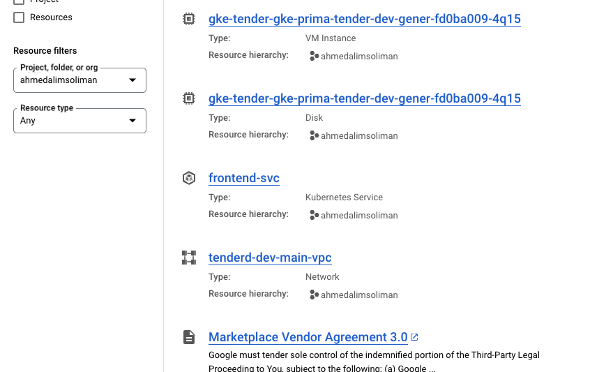
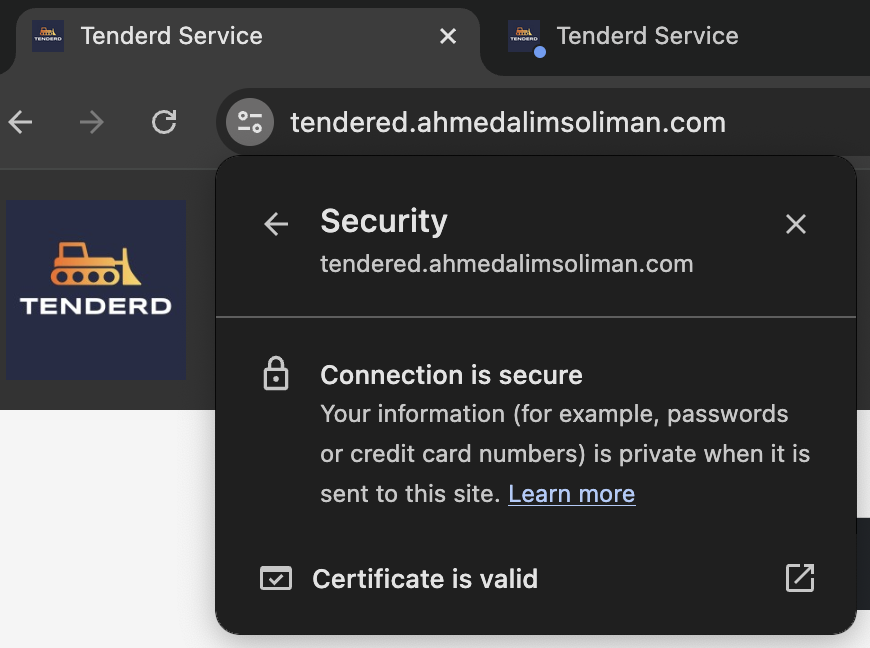

# Tenderd - DevOps Assignment
# Docmentation
## Overview
This services is a microservices-based application designed to manage and streamline various services through a unified platform. The primary objective of this project is to implement a robust CI/CD pipeline, deploy the microservices to a Kubernetes cluster, and integrate monitoring and logging solutions to ensure the application's performance and reliability.

This documentation outlines the project structure, CI/CD pipeline, deployment process, and the integration of GCP services for additional functionality.

## Project Repositories
The project is divided into two repositories:

### Microservices Repository: 
Contains the source code for the microservices.
* Repository: [Tenderd-DevOps-Assignement-3](https://github.com/ahmedamsoliman-1/Tenderd-DevOps-Assignement-3)
* Structure:
```
Tenderd-DevOps-Assignement-3
├── frontend-svc
│   ├── Dockerfile
│   ├── node_modules
│   ├── package.json
│   ├── package-lock.json
│   ├── src
│   ├── tests
├── order-svc
│   ├── Dockerfile
│   ├── package.json
│   ├── package-lock.json
│   ├── src
├── user-svc
│   ├── Dockerfile
│   ├── package.json
│   ├── package-lock.json
│   ├── src
├── docker-compose.yaml
├── README.md
```

### Infrastructure Repository:
Contains the infrastructure as code (IaC) for deploying the microservices to Kubernetes.
* Repository: [Tenderd-DevOps-Assignement-Infra-3](https://github.com/ahmedamsoliman-1/Tenderd-DevOps-Assignement-Infra-3)
* Structure:
```
Tenderd-DevOps-Assignement-Infra-3
├── helm-charts
│   ├── frontend-svc-chart
│   ├── templates
│   ├── values.yaml
├── terraform
│   ├── dev
│   │   ├── main.tf
│   │   ├── outputs.tf
│   │   ├── variables.tf
├── k8-status.sh
├── README.md

```


## CI/CD Pipeline
The CI/CD pipeline is implemented using GitHub Actions, GCP, Terraform and Docker. 
The pipeline performs the following tasks:
### Tenderd-DevOps-Assignement-3: 

#### Deployment Process:
- Code Checkout: Retrieves the latest code from the repository.
- Docker Buildx Setup: Configures Docker Buildx for multi-platform builds.
- Docker Hub Login: Authenticates with Docker Hub using credentials stored in GitHub Secrets.
- Dependency Installation and Testing: Installs dependencies and runs tests for each microservice.
- Docker Image Build and Push: Builds Docker images for each microservice and pushes them to Docker Hub.
#### Github Actions (3):
##### 1- tenderd-build-push-images-hub
```
name: CI

on:
  push:
    branches:
      - dev-1
  pull_request:
    branches:
      - main

jobs:
  btenderd-build-push-images-hub:
    runs-on: ubuntu-latest

    steps:
      - name: Checkout code
        uses: actions/checkout@v3

      - reset of step ...
```
##### tenderd-close-stale-issues
```
name: tenderd-close-stale-issues

on:
  schedule:
    - cron: '30 1 * * *'

jobs:
  tenderd-close-stale-issues:
    runs-on: ubuntu-latest
    steps:
      - uses: actions/stale@v9
        with:
          stale-issue-message: 'This issue is stale because it has been open 30 days with no activity. Remove stale label or comment or this will be closed in 5 days.'
          days-before-stale: 30
          days-before-close: 5
```
##### tenderd-apply-branch-protection
```
name: tenderd-apply-branch-protection

on:
  push:
    branches:
      - main

jobs:
  tenderd-apply-branch-protection:
    runs-on: ubuntu-latest

    steps:
    - name: Apply branch protection rules
      run: |
        echo "Applying relaxed branch protection rules to ${{ github.repository }}"

        curl ...
      env:
        MY_GITHUB_PAT: ${{ secrets.TENDERD_TOKEN }}
```

### Tenderd-DevOps-Assignement-Infra-1: 

#### Deployment Process:
- The deployment process uses Helm charts and Terraform to manage Kubernetes resources and GCP infrastructure.
- Terraform: Manages GCP resources, such as creating a GKE cluster and provisioning necessary infrastructure.
- Helm Charts: Define Kubernetes resources for each microservice.
```
Frontend-svc-chart example:
# Chart.yaml
apiVersion: v2
name: frontend-svc
description: A Helm chart for Kubernetes
version: 0.1.0
appVersion: 1.16.0

```
```
terraform statment to deploy resrouce example: 
provider "google" {
  project = var.project
  region  = var.region
}

resource "google_container_cluster" "primary" {
  name     = "primary-cluster"
  location = var.region

  node_config {
    machine_type = "e2-medium"
  }
}
```

#### Github Actions (5):
##### deploy-upgrade-helm-charts-dev
```
name: tenderd-deploy-dev
run-name: ${{ github.actor }} has triggered the pipeline for to build tendered GKE kubernetes cluster and deploy/upgrade helm charts services. 

on:
  push:
    branches:
      - 'dev'

defaults:
  run:
    shell: bash
    working-directory: ./terraform/dev-gke
  
permissions:
  contents: read
  id-token: write

jobs:
  tenderd-deploy-upgrade-helm-charts-dev:
    runs-on: ubuntu-latest
    needs: deploy-gke-k8-cluster-dev
    steps:
      - name: Checkout
        uses: actions/checkout@v2

      - reset of step ...
```
##### tenderd-prevision-gke-cluster-dev
```
tenderd-prevision-gke-cluster-dev:
    runs-on: ubuntu-latest
    permissions:
      id-token: write 
      contents: read         
    steps:
      - name: Checkout
        uses: actions/checkout@v2
      - name: Configure GCP credentials
        id: auth
        uses: google-github-actions/auth@v2
        with:
          workload_identity_provider: ${{ secrets.WORKLOAD_IDENTITY_PROVIDER }}
          create_credentials_file: true
          service_account: ${{ secrets.SA }}
          token_format: "access_token"
          access_token_lifetime: "120s"
             
      - reset of step ...
```
##### tenderd-close-stale-issues-prs
```
name: 'Close stale issues and PRs'

on:
  schedule:
    - cron: '30 1 * * *'

jobs:
  tenderd-close-stale-issues-prs:
    runs-on: ubuntu-latest
    steps:
      - uses: actions/stale@v9
        with:
          stale-issue-message: 'This issue is stale because it has been open 30 days with no activity. Remove stale label or comment or this will be closed in 5 days.'
          days-before-stale: 30
          days-before-close: 5
```
##### tenderd-apply-branch-protection:
```
name: Apply Branch Rules

on:
  push:
    branches:
      - main

jobs:
  tenderd-apply-branch-protection::
    runs-on: ubuntu-latest

    steps:
    - name: Apply branch protection rules
      run: |
        echo "Applying relaxed branch protection rules to ${{ github.repository }}"

        curl ...
          https://api.github.com/repos/${{ github.repository }}/branches/main/protection
      env:
        MY_GITHUB_PAT: ${{ secrets.TENDERD_TOKEN }}
```
##### destroy-dev
```
name: tenderd-destroy-dev
run-name: ${{ github.actor }} has triggered the pipeline for Terraform

on:
  push:
    branches:
    - 'dev'

defaults:
  run:
    shell: bash
    working-directory: ./terraform/dev-gke
permissions:
  contents: read

jobs:
  destroy-dev:
    runs-on: ubuntu-latest
    permissions:
      id-token: write
      contents: read
    steps:
    - name: "Checkout"
      uses: actions/checkout@v3
    - reset of step ...
```

#### Images
* Created GKE by Github Actions + Terraform on Google Cloud

- resources: 
<p>
  
  
  
</p>

##### Github Actions
- Previosion gke cluster
- Deploy deployments using terraform in gke

- Apply branch protection

- Run check on PR before merge

- github action to build and push images to Docker hub


- gke clustre creation steps: 

- deploy helm charts into gke

## Monitoring
Monitoring and logging are integrated using Prometheus and Grafana for metrics, and ELK stack (Elasticsearch, Logstash, and Kibana) for logs.

## Logging
Logging is not supported yet (possibility to capture and visualize using ELK stack (Elasticsearch, Logstash, and Kibana))

## Docker Compose for Development
The docker-compose.yaml file in micro services repository is used for local development and testing. It simplifies the process of running and managing the microservices locally by defining the necessary services, networks.
- Configuration:
```
version: '3'
services:
  frontend-svc:
    build:
      context: ./frontend-svc
    ports:
      - "3000:3000"
    depends_on:
      - order-svc
      - user-svc

  order-svc:
    build:
      context: ./order-svc
    ports:
      - "3001:3001"

  user-svc:
    build:
      context: ./user-svc
    ports:
      - "3002:3002"

networks:
  default:
    driver: bridge
```


- see REAEME.md for more details. 

## Google Cloud Platform 
This services deployed in Google Cloud Platform (GCP) using Google Kubernetes Engine (GKE). This feature is integrated into the CI/CD pipeline to ensure secure and efficient deployment.
Also GCP bucket is used to host terrafom lock file, for Github Actions to keep track the status of deployed resources and to be used later to destroy resources (with GitHub Actions as well) 
### services used: 
```
- Google Kubernetes Engine
- Google Services and load balancing and ingress
- IAM and Admin
- Google VPC
- Google DNS
- Google Storage
```

## Helm Charts
All services deployed in our Google Kubernetes Engine (GKE) cluster are managed through Helm charts. Helm simplifies the process of deploying, managing, and scaling applications within Kubernetes by packaging all the necessary Kubernetes manifests into a single, reusable chart.
### Overview

Below is a summary of the Helm charts currently deployed in our Kubernetes cluster. These charts manage various services, including monitoring tools, frontend applications, and essential infrastructure components.

### Chart Details

| **Name**                        | **Namespace**   | **Revision** | **Last Updated**                | **Status**  | **Chart**                      | **App Version** |
|---------------------------------|-----------------|--------------|--------------------------------|-------------|--------------------------------|-----------------|
| **cert-manager-release**        | cert-manager    | 2            | 2024-07-23 15:04:00 +0400       | Deployed    | cert-manager-v1.15.1            | v1.15.1         |
| **ingress-nginx**               | ingress-nginx   | 1            | 2024-07-23 12:15:24 +0400       | Deployed    | ingress-nginx-4.11.1            | 1.11.1          |
| **monitoring-grafana-release**  | monitoring      | 6            | 2024-07-23 15:35:36 +0400       | Deployed    | grafana-8.3.6                   | 11.1.0          |
| **monitoring-prometheus-release** | monitoring      | 2            | 2024-07-23 15:40:52 +0400       | Deployed    | prometheus-25.24.1              | v2.53.1         |
| **tenderd-devops-frontend-release** | default         | 9            | 2024-07-23 12:01:40 UTC         | Deployed    | frontend-svc-chart-0.1.0        | 1.16.0          |
| **tenderd-order-frontend-release** | default         | 4            | 2024-07-23 12:01:42 UTC         | Deployed    | order-svc-chart-0.1.0           | 1.16.0          |
| **tenderd-user-frontend-release**  | default         | 4            | 2024-07-23 12:01:41 UTC         | Deployed    | user-svc-chart-0.1.0            | 1.16.0          |

### Description of Deployed Charts

#### **cert-manager**
- **Namespace:** `cert-manager`
- **Purpose:** Automates the management and issuance of TLS certificates.
- **Chart Version:** `v1.15.1`
- **Status:** Deployed

#### **ingress-nginx**
- **Namespace:** `ingress-nginx`
- **Purpose:** Provides an ingress controller for routing external traffic to services within the cluster.
- **Chart Version:** `ingress-nginx-4.11.1`
- **Status:** Deployed

#### **monitoring-grafana-release**
- **Namespace:** `monitoring`
- **Purpose:** Provides a powerful monitoring and visualization tool for metrics.
- **Chart Version:** `grafana-8.3.6`
- **Status:** Deployed

#### **monitoring-prometheus-release**
- **Namespace:** `monitoring`
- **Purpose:** Prometheus is used for event monitoring and alerting.
- **Chart Version:** `prometheus-25.24.1`
- **Status:** Deployed

#### **tenderd-devops-frontend-release**
- **Namespace:** `default`
- **Purpose:** Deploys the frontend service for the DevOps application.
- **Chart Version:** `frontend-svc-chart-0.1.0`
- **Status:** Deployed

#### **tenderd-order-frontend-release**
- **Namespace:** `default`
- **Purpose:** Deploys the order service.
- **Chart Version:** `order-svc-chart-0.1.0`
- **Status:** Deployed

#### **tenderd-user-frontend-release**
- **Namespace:** `default`
- **Purpose:** Deploys the user service.
- **Chart Version:** `user-svc-chart-0.1.0`
- **Status:** Deployed

### Note:
Helm charts deployment manged by Github Actions CI/CD: 
```
- tenderd-devops-frontend-release
- tenderd-order-frontend-release
- tenderd-user-frontend-release
```

## Future Enhacments
- Enhancing Logging: Integrate ELK stack for comprehensive log management.

## Security
### HTTPS Setup with Cert-Manager
To secure our services with HTTPS, Cert-Manager helm chart has been deployed in the Kubernetes cluster using Helm. Cert-Manager automates the management and issuance of TLS certificates from various certificate authorities (CAs), such as Let's Encrypt.
```
Name:         monitoring-cert
Namespace:    default
Labels:       <none>
Annotations:  <none>
API Version:  cert-manager.io/v1
Kind:         Certificate
Metadata:
  Creation Timestamp:  2024-07-23T11:12:03Z
  Generation:          1
  Resource Version:    104267
  UID:                 73774dba-9360-4839-b52d-d941ac87b437
Spec:
  Common Name:  tendered.ahmedalimsoliman.com
  Dns Names:
    tendered.ahmedalimsoliman.com
  Issuer Ref:
    Kind:       ClusterIssuer
    Name:       letsencrypt-prod
  Secret Name:  monitoring-cert-tls
Status:
  Conditions:
    Last Transition Time:  2024-07-23T11:12:28Z
    Message:               Certificate is up to date and has not expired
    Observed Generation:   1
    Reason:                Ready
    Status:                True
    Type:                  Ready
  Not After:               2024-10-21T10:12:26Z
  Not Before:              2024-07-23T10:12:27Z
  Renewal Time:            2024-09-21T10:12:26Z
  Revision:                1
Events:
  Type    Reason     Age   From                                       Message
  ----    ------     ----  ----                                       -------
  Normal  Issuing    37m   cert-manager-certificates-trigger          Issuing certificate as Secret does not exist
  Normal  Generated  37m   cert-manager-certificates-key-manager      Stored new private key in temporary Secret resource "monitoring-cert-f8xmh"
  Normal  Requested  37m   cert-manager-certificates-request-manager  Created new CertificateRequest resource "monitoring-cert-1"
  Normal  Issuing    37m   cert-manager-certificates-issuing          The certificate has been successfully issued
```

With Cert-Manager, TLS certificates are automatically managed and renewed, ensuring secure HTTPS access to our services with minimal manual intervention.

## Check the current services running
- Tenderd  Frontend - URL [Go](http://tendered.ahmedalimsoliman.com/)
- Grafana Dashboards for running apps and k8 ifra [Go](http://grafana.ahmedalimsoliman.com/)
- Promethues Dashboards [Go](http://prom.ahmedalimsoliman.com/)


